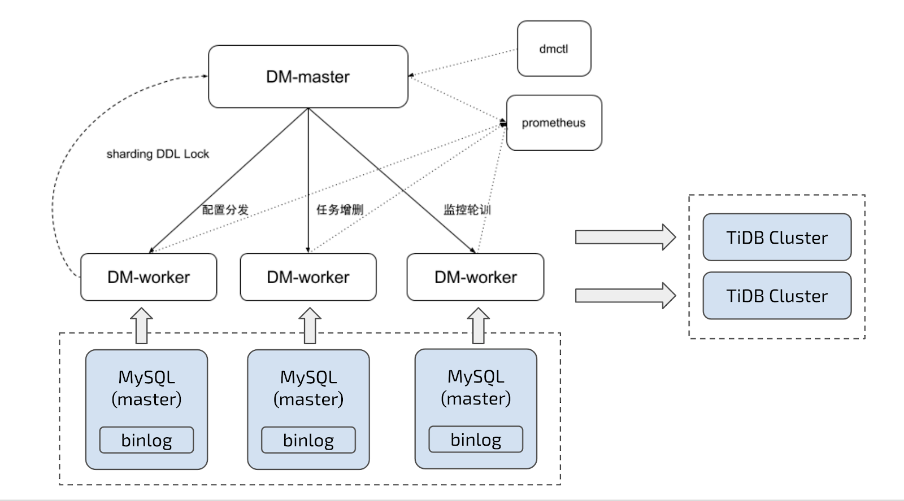

Get Started
===

### 内容索引
- [介绍](#介绍 DM)
- [安装](#部署 DM 集群)
- [启动同步任务](#启动同步任务)
- [监控与日志](#监控与日志)

### 介绍 DM

DM (Data Migration) 是基于 mydumper / loader / syncer 的调度管理一体化工具产品，设计的主要目的是
   - 标准化 （e.g. 工具运行，错误定义）
   - 降低运维使用成本
   - 简化错误处理流程
   - 提升产品使用体验


#### 架构图

   


#### 组件介绍

##### dm-master

- 保存 DM 集群的拓扑信息
- 监控 dm-worker 进程的运行
- 监控数据同步任务的运行状态
- 提供数据同步任务管理的统一入口
- 协调 sharding 场景下各个实例的分表 DDL 同步

##### dm-worker

- binlog 的本地持久化保存
- 保存数据同步子任务的配置信息
- 编排数据同步子任务的运行
- 监控数据同步子任务的运行状态

##### dmctl

- 创建 / 更新 / 删除数据同步任务
- 查看数据同步任务状态
- 处理数据同步任务错误
- 校验数据同步任务配置的正确性

##### 同步任务

- 用户通过 yaml 配置文件创建的从 MySQL/MariaDB 同步数据到 TiDB 的任务

### 部署 DM 集群

目前，推荐使用 dm-ansible 来部署 DM 集群，具体部署方法请参考 [DM Ansible 部署安装](./maintenance/dm-ansible.md)。

#### 注意事项

在 DM 的所有相关配置文件中，数据库相关的密码需要使用 dmctl 加密后的密文（如果数据库密码为空，则不需要加密）。

了解如何使用 dmctl 加密明文密码，可以参考 [dmctl 加密上游 MySQL 用户密码](./maintenance/dm-ansible.md#dmctl-加密上游-mysql-用户密码)。

此外，DM 在运行过程中，相关的上下游数据库用户需要具备相应的读写权限。DM 在启动任务过程中，也会自动进行部分权限检查，具体见 [上游 MySQL 实例权限](./task-handling/check-mysql.md)。


### 启动同步任务

#### 1 检查集群信息

假设按上述步骤使用 dm-ansible 部署 DM 集群后，DM 集群中相关组件配置信息如下：

| 组件 | IP | 服务端口 |
|------| ---- | ---- |
| dm-worker | 172.16.10.72 | 10081 |
| dm-worker | 172.16.10.73 | 10081 |
| dm-master | 172.16.10.71 | 11080 |

上下游数据库实例相关信息如下：

| 数据库实例 | IP | 端口 | 用户名 | 加密后密码 |
| -------- | --- | --- | --- | --- |
| 上游 MySQL-1 | 172.16.10.81 | 3306 | root | VjX8cEeTX+qcvZ3bPaO4h0C80pe/1aU= |
| 上游 MySQL-2 | 172.16.10.82 | 3306 | root | VjX8cEeTX+qcvZ3bPaO4h0C80pe/1aU= |
| 下游 TiDB | 172.16.10.83 | 4000 | root | |


使用 dm-ansible 部署完成后，dm-master 进程配置文件 `{ansible deploy}/conf/dm-master.toml` 内容应该如下：

```toml
# Master Configuration.

[[deploy]]
mysql-instance = "172.16.10.81:3306"
dm-worker = "172.16.10.72:10081"

[[deploy]]
mysql-instance = "172.16.10.82:3306"
dm-worker = "172.16.10.73:10081"
```

#### 2 任务配置

假设需要将 MySQL-1 和 MySQL-2 的 `test_db` 库的 `test_table` 表都以 **全量+增量** 的模式同步到下游 TiDB 的 `test_db` 库的 `test_table` 表。

任务配置示例模版位置 `{ansible deploy}/conf/task.yaml.example`
COPY `{ansible deploy}/conf/task.yaml.example` 并且编辑，生成如下任务配置文件 `task.yaml`

```yaml
name: "test"                  # 任务名，多个同时运行的任务不能重名
task-mode: "all"              # 全量+增量 (all) 同步模式
disable-heartbeat: true       # 禁用 heartbeat 同步延迟计算

target-database:              # 下游 TiDB 配置信息
  host: "172.16.10.83"
  port: 4000
  user: "root"
  password: ""

mysql-instances:                                  # 当前任务需要使用的全部上游 MySQL 实例
-
  config:                                         # MySQL-1 配置
    host: "172.16.10.81"
    port: 3306
    user: "root"
    password: "VjX8cEeTX+qcvZ3bPaO4h0C80pe/1aU="  # 明文 `123456` 某次加密后的密文，每次加密产生的密文会不同
  instance-id: "172.16.10.81:3306"                # MySQL-1 的实例 ID，与 dm-master.toml 中的 `mysql-instance` 对应
  black-white-list: "global"                      # 需要同步的库名/表名黑白名单的配置项名称，用于引用全局的黑白名单配置
  mydumper-config-name: "global"                  # mydumper 的配置项名称，用于引用全局的 mydumper 配置

-
  config:                                         # MySQL-2 配置
    host: "172.16.10.82"
    port: 3306
    user: "root"
    password: "VjX8cEeTX+qcvZ3bPaO4h0C80pe/1aU="
  instance-id: "172.16.10.82:3306"
  black-white-list: "global"
  mydumper-config-name: "global"

# 黑白名单全局配置，各实例通过配置项名引用
black-white-list:
  global:
    do-tables:                                    # 需要同步的上游表
    - db-name: "test_db"                          # 需要同步的表的库名
      tbl-name: "test_table"                      # 需要同步的表的表名

# mydumper 全局配置，各实例通过配置项名引用
mydumpers:
  global:
    mydumper-path: "./bin/mydumper"               # mydumper binary 的路径
    extra-args: "-B test_db -T test_table"        # 只 dump test_db 库中的 test_table 表
```

#### 3 启动任务

进入 dmctl 目录（`/home/tidb/dm-ansible/resource/bin/`），使用以下命令启动 dmctl：
```bash
./dmctl --master-addr 172.16.10.71:11080
```

在 dmctl 命令行内，使用以下命令启动同步任务：
```bash
start-task task.yaml            # task.yaml 为上一步编辑的配置文件路径
```

如果启动任务成功，将返回以下信息：
```json
{
    "result": true,
    "msg": "",
    "workers": [
        {
            "result": true,
            "worker": "172.16.10.72:10081",
            "msg": ""
        },
        {
            "result": true,
            "worker": "172.16.10.73:10081",
            "msg": ""
        }
    ]
}
```

如果返回其他信息，可根据其中的提示进行配置变更后使用 `start-task task.yaml` 重启任务。

#### 4 查询任务

如果需要了解 DM 集群中是否运行有同步任务及任务状态等信息，可以在 dmctl 命令行内使用以下命令进行查询：
```bash
query-status
```

#### 5 停止任务

如果不再需要进行数据同步，可以在 dmctl 命令行内使用以下命令停止同步任务
```bash
stop-task test              # 其中的 `test` 是 `task.yaml` 配置文件中 `name` 配置项设置的任务名
```


### 监控与日志

#### 3DM 监控 dashboard

假设参考 [1. 部署 DM 集群](#1-部署-dm-集群) 部署 DM 集群时，正确部署了 prometheus 与 grafana，且 grafana 的地址为 `172.16.10.71`。

在浏览器中打开 <http://172.16.10.71:3000> 进入 grafana，选择 DM 的 dashboard 即可看到 DM 相关监控项，具体各监控项的解释参见 [DM 监控与告警](./maintenance/metrics-alert.md)。

#### DM log

DM 在运行过程中，dm-worker, dm-master 及 dmctl 都会通过 log 输出相关信息。

其中，dm-worker, dm-master 的 log 文件输出目录参见 [部署目录结构](./maintenance/directory-structure.md)，dmctl 的 log 文件与其 binary 同目录。


### 下一步

接下来，可以阅读 [用户使用手册](./user-manual.md) 更详细地了解 DM，也可以从 [DM 用户文档索引](./README.md#DM-用户文档索引) 开始阅读感兴趣的内容。
