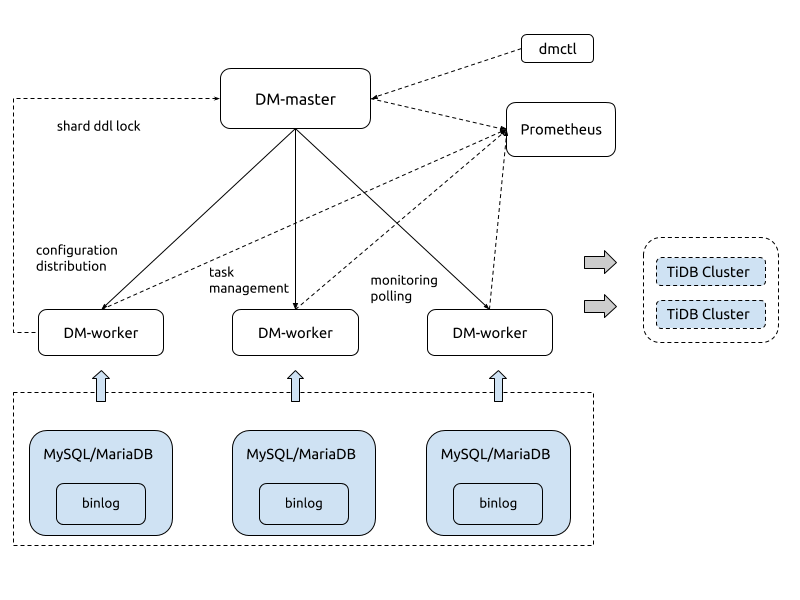

DM 简介
===

### 介绍

DM (Data Migration) 是一体化数据同步任务管理平台，支持全量备份和 MariaDB/MySQL binlog 增量同步，设计的主要目的是
   - 标准化 （例如 工具运行，错误定义）
   - 降低运维使用成本
   - 简化错误处理流程
   - 提升产品使用体验

### 架构图

   

***

### 组件功能

#### DM-master

- 保存 DM 集群的拓扑信息
- 监控 DM-worker 进程的运行
- 监控数据同步任务的运行状态
- 提供数据同步任务管理的统一入口
- 协调 sharding 场景下各个实例的分表 DDL 同步

#### DM-worker

- 支持 binlog 本地持久化
- 保存数据同步子任务的配置信息
- 编排数据同步子任务的运行
- 监控数据同步子任务的运行状态

参考 [DM-worker 详细介绍](./dm-worker-unit.md)

#### dmctl

- 创建 / 更新 / 删除数据同步任务
- 查看数据同步任务状态
- 处理数据同步任务错误
- 校验数据同步任务配置的正确性

***

### 同步功能介绍

#### schema / table 路由

可以把上游 MySQL/MariaDB 实例的某些表同步到下游指定表的路由功能，可以用来分库分表的合并同步，详情见 [table route rule 介绍](./features/table-route.md)

#### schema / table 同步黑白名单

上游数据库实例表的黑白名过滤名单规则。过滤规则类似于 MySQL replication-rules-db / tables, 可以用来过滤或者只同步某些 database 或者某些 table 的所有操作。详情见 [black white list 介绍](./features/black-white-list.md)

#### binlog Event 过滤

比 `schema / table` 同步黑白名单更加细粒度的过滤规则，可以指定只同步或者过滤掉某些 `schema / table` 的指定类型 binlog， 比如 `INSERT`，`TRUNCATE TABLE`。详情见 [binlog filter 介绍](./features/binlog-filter.md)

#### 列值转换

根据用户指定的内置表达式对表的列进行转换，可以用来解决分库分表自增主键 ID 的冲突，详情见 [column mapping rule 介绍](./features/column-mapping.md)

#### 分库分表支持

DM 支持对原分库分表进行合库合表操作，但需要满足一些限制，详情见 [分库分表](./shard-table)

***

### 使用 DM
您可以选择

- 阅读[快速开始](./get-started.md)来快速部署和启动一个同步任务
- 按照下面的学习路线深入了解 DM，然后定制数据同步任务
  1. 阅读并且了解 [使用限制](./restrictions.md)
  2. 根据 [DM Ansible 运维手册](./maintenance/dm-ansible.md) 文档部署和管理 DM 集群
  3. 阅读并且了解 [配置文件](./configuration/configuration.md)
  4. 学习 [任务管理](./task-handling) 章节来管理和查看任务的运行
  5. 学习了解同步案例
     1. [简单的从库同步场景](./use-cases/one-tidb-slave.md)
     2. [简单的从库同步场景](./use-cases/shard-merge.md)
