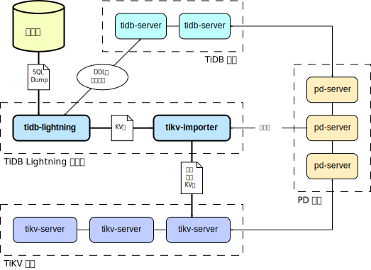

软件架构
=======

TiDB Lightning 主要包含两个部分:

- **`tidb-lightning`** (“前端”) 主要完成适配工作，通过读取 SQL dump，在下游 TiDB 集群建表、
    将数据转换成键/值对 (KV 对) 发送到 `tikv-importer`、检查数据完整性等等。

- **`tikv-importer`** (“后端”) 主要完成数据导入 TiKV 集群的工作，把 `tidb-lightning` 写入的 KV 对缓存、排序、
    切分并导入到 TiKV 集群。

整体工作原理如下：

1. 在导数据之前，`tidb-lightning` 会自动将 TiKV 集群切换为“导入模式” (import mode)，
    优化写入效率并停止自动压缩 (compaction)。

2. `tidb-lightning` 会在目标数据库建立架构和表，并获取其元数据。

3. `tidb-lightning` 会通过 gRPC 让 `tikv-importer` 为对每一张表准备一个“引擎文件 (engine file)”
    来处理 KV 对。`tidb-lightning` 会并发读取 SQL dump，将数据源转换成与 TiDB 相同编码的 KV 对，
    然后发送到 `tikv-importer` 里对应的引擎文件。

4. 当一整个表完全导入到 `tikv-importer`，它便开始对目标 TiKV 集群数据进行分裂和调度，然后导入数据到 TiKV 集群。

5. 之后，`tidb-lightning` 会对比本地数据源及下游集群的校验和 (checksum)，确保导入的数据无损。

6. 整个数据库完成导入后，`tidb-lightning` 便会让 TiKV 集群进行一次全局压缩，以及让 TiDB 分析 (`ANALYZE`)
    这些新增的数据，以优化日后的操作。

7. 在所有步骤完毕后，`tidb-lightning` 自动将 TiKV 切换回“普通模式” (normal mode)，
    此后 TiDB 集群可以正常对外提供服务。
